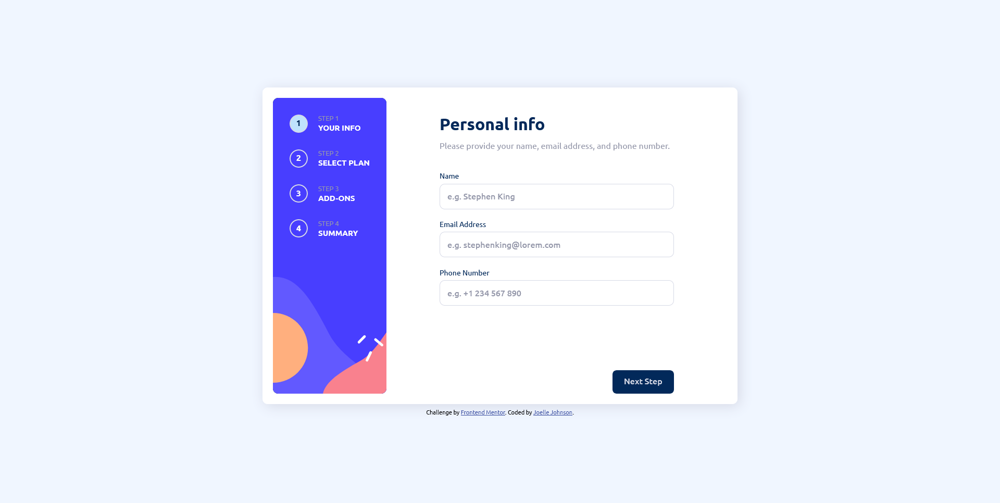

# Frontend Mentor - Multi-step form solution

This is a solution to the [Multi-step form challenge on Frontend Mentor](https://www.frontendmentor.io/challenges/multistep-form-YVAnSdqQBJ). Frontend Mentor challenges help you improve your coding skills by building realistic projects. 

## Table of contents

- [Overview](#overview)
  - [The challenge](#the-challenge)
  - [Screenshot](#screenshot)
  - [Links](#links)
- [My process](#my-process)
  - [Built with](#built-with)
  - [What I learned](#what-i-learned)
- [Author](#author)

## Overview

### The challenge

Users should be able to:

- Complete each step of the sequence
- See a summary of their selections on the final step and confirm their order
- View the optimal layout for the interface depending on their device's screen size
- See hover and focus states for all interactive elements on the page

### Screenshot

### Links

- Solution URL: [Github](https://github.com/johnsonjoelle/FEM-multi-step-form)
- Live Site URL: [Github Pages](https://johnsonjoelle.github.io/FEM-multi-step-form/)

## My process

### Built with

- Semantic HTML5 markup
- CSS custom properties
- Flexbox
- CSS Grid
- Desktop-first workflow

### What I learned

This was my first time using tabindex to make elements focusable. I also usually use jquery for my js code, coding this in plain JavaScript was a good refresher for me.

## Author

- Website - [Joelle Johnson](https://joellejohnson.com)
- Frontend Mentor - [@johnsonjoelle](https://www.frontendmentor.io/profile/johnsonjoelle)
